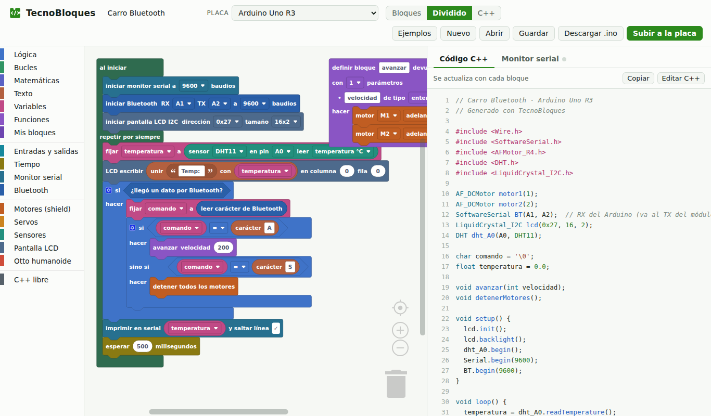
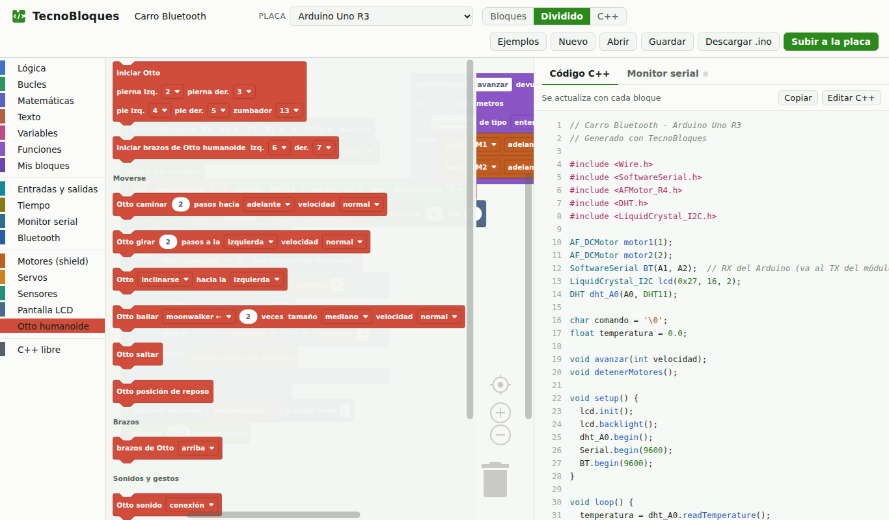

<p align="center"></p>

# TecnoBloques

Editor web de **programación por bloques en español para Arduino**, hecho en la
TecnoAcademia Tolima (SENA). Arma el programa con bloques, mira el C++ que se
genera en vivo y ábrelo en tu placa. Funciona con **Arduino Uno R3, Nano y Mega 2560**.



## Qué trae

- **Tres niveles** que se eligen en la barra superior: **1 Explorador** (secuencias, repetir y decidir con un sensor), **2 Constructor** (variables, sensores, Bluetooth y bloques propios) y **3 Inventor** (funciones con parámetros, tiempo sin esperar y C++). El proyecto guarda su nivel, así cada reto abre en el que corresponde.
- **Bloques de la TecnoAcademia:**
  - Shield de motores L293D (AFMotor_R4)
  - Sensor DHT11/DHT22
  - Pantalla LCD 16x2 o 20x4 por I2C, con **símbolos propios** que se dibujan con el mouse
  - **Matriz LED 8x8** (MAX7219): dibujos con el mouse, animaciones, texto que pasa, y orientación + espejo para que nunca haya que dibujar al revés
  - **Boca de Otto**: las 31 bocas de Otto, dibujos propios que giran igual que ellas, y texto
  - **Sensor de movimiento MPU6050** (inclinación en grados, aceleración, giro)
  - **Controlador de 16 servos PCA9685** (servos en grados; **calibración por canal** con nombre: base, hombro, codo, pinza…)
  - **Bus I2C:** "buscar dispositivos" (dice si tu LCD es 0x27 o 0x3F) y envío/lectura de bytes
  - Monitor serial
  - Bluetooth HC-05/HC-06
  - Servos
  - Ultrasonido HC-SR04
  - **Otto humanoide** (caminar, bailar, gestos, sonidos y brazos), con **calibración** que queda guardada en el robot
- **Nombres para los pines:** "el pin 13 se llama LedRojo" (`#define`). Luego eliges LedRojo en cualquier menú de pines.
- **Listas y matrices** (nivel 3): melodías, listas de pines, mediciones y coreografías de Otto en una tabla que se edita con el mouse.
- **Variables con tipo** (entero, decimal, texto, carácter…) y **funciones propias** con parámetros y valor de retorno.
- **Mis bloques:** guarda tus funciones y úsalas en cualquier otro programa. Se pueden exportar e importar como archivo.
- **C++ libre:** mezcla bloques con líneas de código escritas a mano.
- **Vista dividida:** el C++ se actualiza con cada bloque. También puedes editar el C++ directamente.
- **Avisos de pines:** te dice cuando dos cosas usan el mismo pin o cuando un pin no sirve para lo que pides.
- **Monitor serial** que recibe y **envía** mensajes a la placa (Web Serial).
- Proyectos que se guardan en un archivo `.tbq.json` y ejemplos listos.



## Usarlo

**En el aula: la app de escritorio (Windows).** Descarga `TecnoBloques-Setup-<versión>.exe` desde
[Releases](https://github.com/EMariotte/TecnoBloques/releases) e instálalo. Trae el compilador de
Arduino y las librerías, así que compila y **sube a la placa con un botón, sin internet**. Elige la
placa y el puerto arriba, y pulsa **Subir a la placa**. Se actualiza sola cuando hay versión nueva.

> El instalador aún no está firmado: si Windows muestra "Windows protegió su PC", elige
> "Más información" → "Ejecutar de todas formas".

**En casa: la versión web.** Abre `dist/TecnoBloques.html` en **Chrome o Edge** de computador.
Programa, guarda tu proyecto (`.tbq.json`) para abrirlo en el aula, o descarga el `.ino` para Arduino IDE.

> El monitor serial de la versión web usa Web Serial: no funciona en Firefox, Safari ni celulares.

## Desarrollo

```powershell
npm install
npm run build          # genera dist/TecnoBloques.html
pip install -r test/requirements.txt
python -m playwright install chromium
npm test               # genera el C++ de los ejemplos y de todos los bloques
npm run compilar       # compila ese C++ con arduino-cli (ver test/instalar-librerias.ps1)

# App de escritorio
npm run preparar-arduino   # una vez: arduino-cli + núcleo AVR + librerías para el instalador
npm run app                # abre la app
npm run test:app           # prueba la app (puertos, compilar, mensajes de error)
npm run instalador         # arma el instalador de Windows
```

La documentación técnica completa está en [`CLAUDE.md`](CLAUDE.md): arquitectura, cómo agregar
bloques o placas, decisiones y hoja de ruta. El historial del proyecto está en [`BITACORA.md`](BITACORA.md).

## Hoja de ruta

- [x] **Fase 1:** editor, generador C++, funciones, Mis bloques, C++ libre, monitor serial
- [x] **Fase 2:** app de escritorio (Electron + arduino-cli) que compila y sube con un botón, con instalador y actualización automática (falta probar con placas reales)
- [x] **Niveles 1 · 2 · 3** de bloques y nombres para los pines (`#define LedRojo 13`)
- [x] **Librerías nuevas:** MPU6050, PCA9685 (Adafruit_PWMServoDriver) e I2C
- [x] **Listas y matrices** (nivel 3)
- [ ] **Fase 3:** Arduino Uno R4
- [ ] **Fase 4:** pantallas OLED
- [ ] **Fase 5:** diseñador de bloques para instructores

## Créditos

Hecho con [Blockly](https://developers.google.com/blockly) (Apache 2.0). Los bloques de Otto
generan código para [OttoDIYLib](https://github.com/OttoDIY/OttoDIYLib). Los de motores
generan código para [AFMotor R4 Compatible](https://github.com/PhoenixSmaug/AFMotor-Shield-R4-Compatible).

Efraín Guillermo Mariotte Parra — Facilitador de Robótica, TecnoAcademia Tolima (SENA).

## Marca

El robot de TecnoBloques está hecho de **dos bloques encajados**: un ojo es un engranaje (robótica), el otro un
cursor (código), y la antena es una **T** de TecnoAcademia. Colores institucionales del SENA. Archivos y reglas de
uso en [`marca/MARCA.md`](marca/MARCA.md).

## Licencia

[Apache 2.0](LICENSE). © 2026 SENA – TecnoAcademia Tolima. Ver [`NOTICE`](NOTICE).
